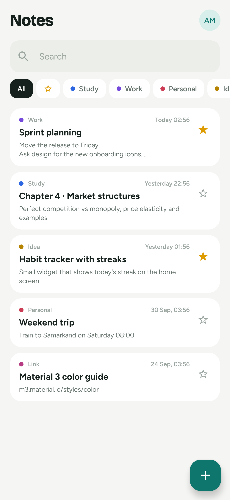
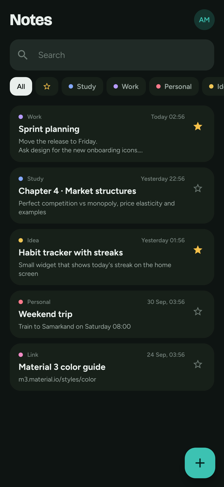
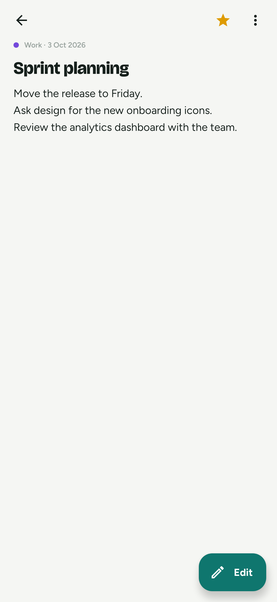
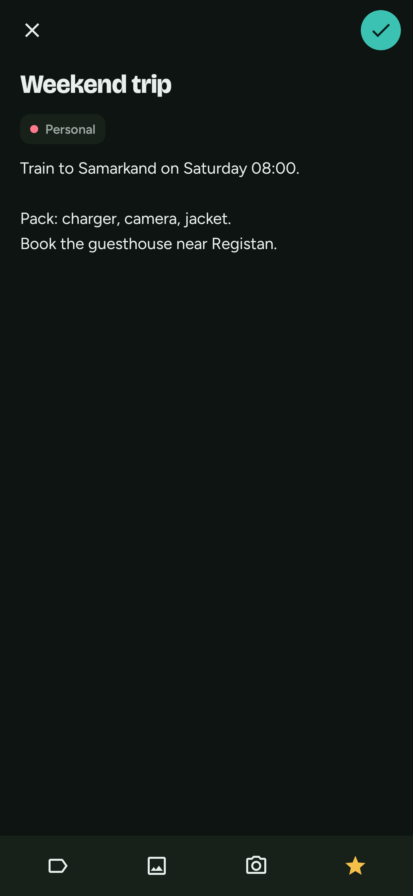
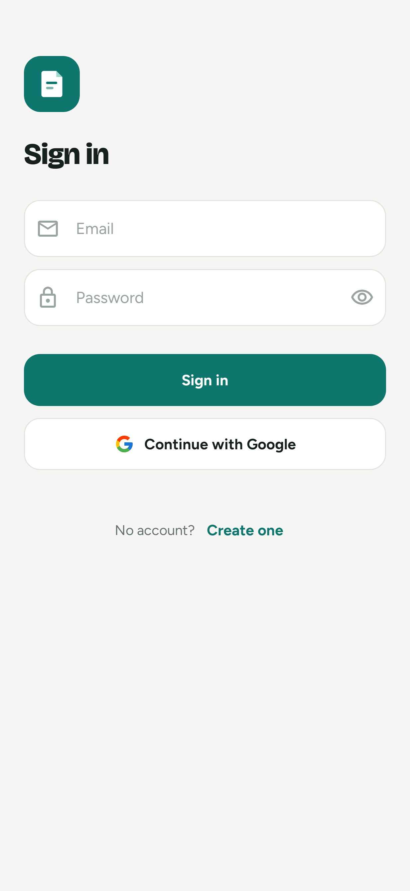
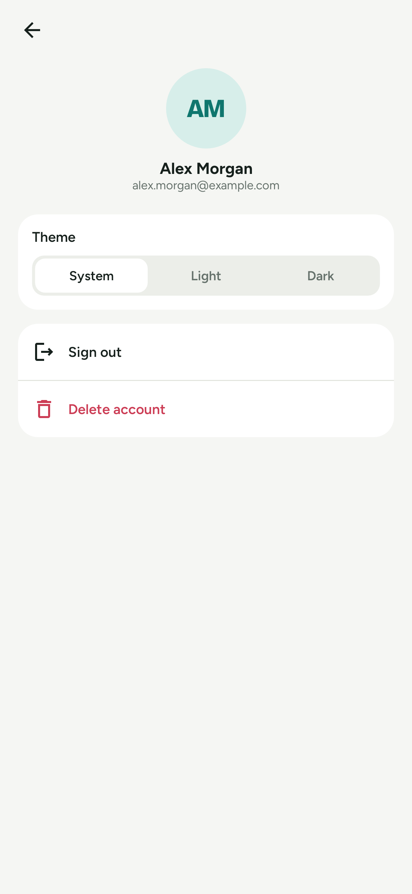

<div align="center">

# Notes

A minimal notes app for Android: write, sort by category, attach photos and find anything fast.
Text syncs through Firebase, photos stay on the device.

[](https://github.com/AdilxanKenesov/NoteApp/releases/latest)


</div>

## Screenshots

| Home | Home · dark | Note |
|:---:|:---:|:---:|
|  |  |  |
| **New note** | **Sign in** | **Profile** |
|  |  |  |

## Features

- **Notes in five categories**: Study, Work, Personal, Idea, Link, each with its own color.
- **Live sync**: the list updates by itself when a note changes on another device (Firestore snapshot listeners).
- **Photos**: up to 10 per note from the gallery or the camera, compressed and stored on the device (Room + app files).
- **Search and filters**: by text, favourites or category.
- **Swipe to delete** with **Undo**.
- **Created time** on every card: `Today 14:32`, `Yesterday 09:10`, `3 Oct, 14:32`.
- **Favourites** with one tap.
- **Sign in** with email/password or Google (Credential Manager).
- **Theme**: System, Light or Dark, switched live.
- **Account deletion** with re-authentication; removes notes, profile and local photos.

## Download

Get the latest APK from [**Releases**](https://github.com/AdilxanKenesov/NoteApp/releases/latest) and open it on your phone
(allow “Install unknown apps” for your browser or file manager when Android asks).

## Tech stack

| Area | Library |
|---|---|
| UI | Jetpack Compose, Material 3, Figtree & Bricolage Grotesque fonts |
| Architecture | MVI with [Orbit 12](https://orbit-mvi.org) (`OrbitContainerHost`), clean layers |
| Navigation | [Voyager](https://voyager.adriel.cafe) + a `Channel`-based navigator |
| DI | Hilt |
| Async | Coroutines, `Flow`, `callbackFlow` |
| Backend | Firebase Auth, Cloud Firestore |
| Local storage | Room (photos), SharedPreferences (theme) |
| Images | Coil, ExifInterface |
| Tests | JUnit, orbit-test, coroutines-test, Roborazzi + Robolectric (screenshots) |

## Architecture

```
presenter  ──►  domain  ◄──  data
(Compose,       (models,      (Firestore, Room,
 ViewModels)     use cases,    files, prefs)
                 repository
                 interfaces)
```

Every screen follows the same shape:

| File | Role |
|---|---|
| `XContract` | `ViewModel` interface (`OrbitContainerHost<State, State, SideEffect>`), `Intent`, `SideEffect`, `UiState`, `Directions` |
| `XViewModel` | `orbitContainer(UiState()) { onCreate }`; one-time loading in `onCreate`, live data in `repeatOnSubscription` |
| `XDirections` | Navigation, injected so the ViewModel never touches Voyager |
| `XScreen` | Collects state and side effects; draws a stateless `XScreenContent` |

Live data comes from `callbackFlow` wrappers:

- the Firestore notes list and a single note (snapshot listeners),
- the Firebase auth state,
- the theme setting (SharedPreferences listener).

Use cases return `Flow<Result<T>>`.

<details>
<summary>Project structure</summary>

```
app/src/main/java/uz/gita/notesapp
├── app/            MyApp (Hilt)
├── data/
│   ├── model/      Firestore documents (NotesData, UserData)
│   ├── repository_impl/
│   ├── source/     SharedPreferences, Room (images)
│   └── storage/    ImageStorage: copy, rotate, compress photos
├── di/             Hilt modules
├── domain/
│   ├── model/      NoteUIData, NoteType, ThemeMode, …
│   ├── repository/ interfaces
│   └── usecase/    interfaces + impl/
├── navigation/     AppNavigator, dispatcher
├── presenter/      splash, login, register, home, detail, addedit, profile
├── ui/             theme + shared components
└── utils/
```

</details>

## Build it yourself

**Requirements:** Android Studio (AGP 9.2), JDK 17, a Firebase project.

1. **Firebase**
   - Create an Android app with package `uz.gita.notesapp`.
   - Put its `google-services.json` into `app/`.
   - Enable **Authentication → Email/Password** and **Google**.
   - Create a **Cloud Firestore** database and publish [`firestore.rules`](firestore.rules).
2. **Google sign-in**
   - Add the SHA-1 of every key you sign with in **Project settings → Your apps**: the debug key and the release key.
   - Set `SERVER_CLIENT_ID` in `utils/GoogleIdToken.kt` to your project's Web client ID.
3. **Run**: `./gradlew installDebug`

### Release build

Signing data is read from `keystore.properties` in the project root. The file is git-ignored.

```properties
storeFile=/absolute/path/to/release.jks
storePassword=…
keyAlias=…
keyPassword=…
```

On CI the same values can come from the environment variables `NOTES_KEYSTORE_FILE`, `NOTES_KEYSTORE_PASSWORD`, `NOTES_KEY_ALIAS` and `NOTES_KEY_PASSWORD`.

```bash
./gradlew assembleRelease   # → app/build/outputs/apk/release/app-release.apk
```

Before each release, raise `versionCode` and `versionName` in `app/build.gradle.kts`.

### Tests and screenshots

```bash
./gradlew testDebugUnitTest       # ViewModel, formatter and screenshot tests
./gradlew recordRoborazziDebug    # regenerate docs/screenshots/*.png
```

The screenshots are rendered from the real Compose screens with demo data, so they never show a personal account.

## Data and privacy

- Note text and the profile live in Firestore under `users/{uid}`. The [security rules](firestore.rules) only let a signed-in user read and write their own documents, and they check every field.
- Photos never leave the phone. Deleting a note or the account deletes them too.
